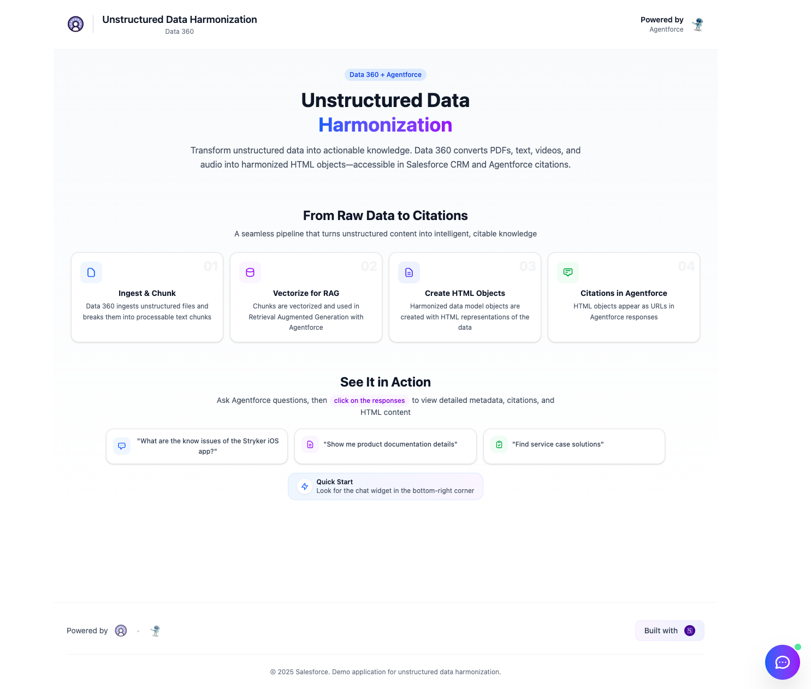
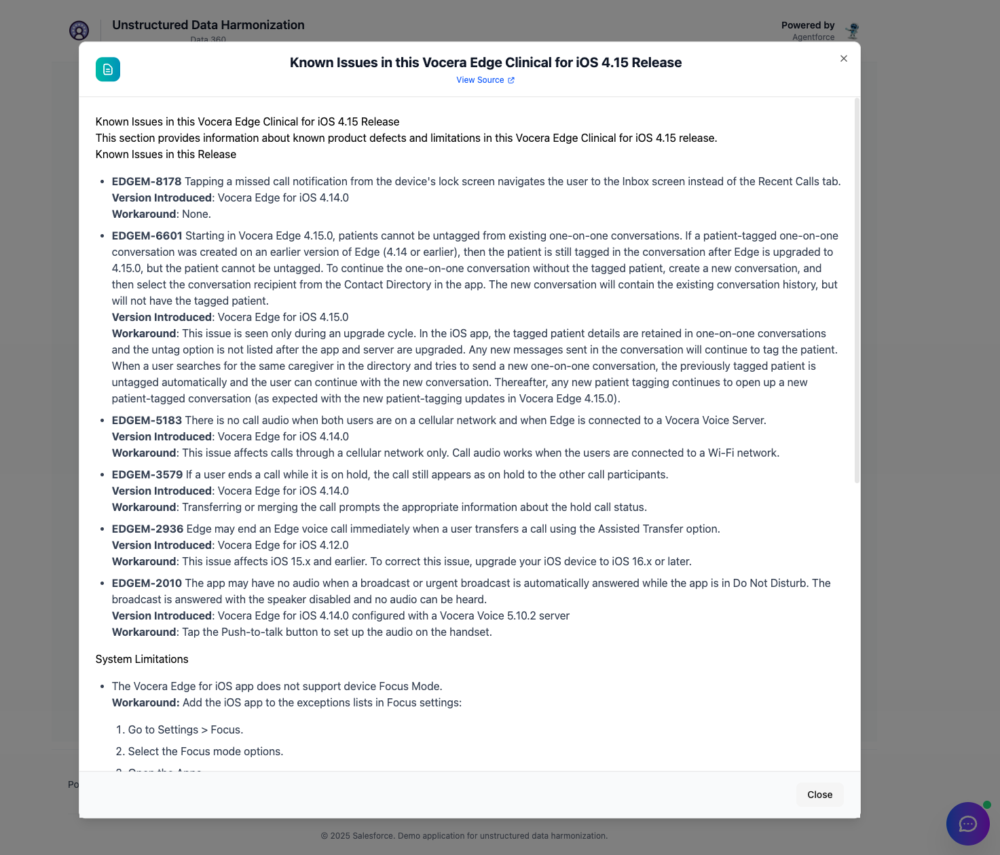
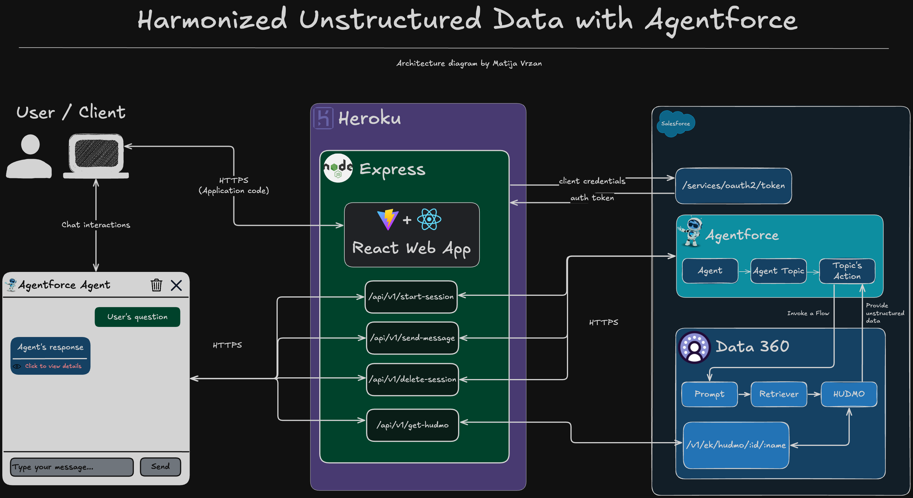

<p align="center">
<a  href="https://www.salesforce.com/agentforce/"></a>
<a href="https://www.salesforce.com/data/"></a>
<a  href="https://www.heroku.com/"></a>
<p/>

# Harmonized Unstructured Data With Data 360

Learn how you can use Harmonized Unstructured data with Data 360 and Agentforce.

# Table of Contents

- [Harmonized Unstructured Data With Data 360](#harmonized-unstructured-data-with-data-360)
- [Table of Contents](#table-of-contents)
  - [What does it do?](#what-does-it-do)
  - [How does it work?](#how-does-it-work)
  - [Demo](#demo)
    - [Welcome screen](#welcome-screen)
    - [Message details](#message-details)
    - [Harmonized Unstructured Data Modal](#harmonized-unstructured-data-modal)
  - [API Specification](#api-specification)
    - [Architecture diagram](#architecture-diagram)
  - [Technologies used](#technologies-used)
- [Configuration](#configuration)
  - [Requirements](#requirements)
  - [Setup](#setup)
    - [Local environment configuration](#local-environment-configuration)
  - [Deployment](#deployment)
    - [Heroku Deployment](#heroku-deployment)
- [License](#license)
- [Disclaimer](#disclaimer)

---

## What does it do?

This application demonstrates **Salesforce Data Cloud's unstructured data harmonization capabilities** integrated with **Agentforce**. It provides an interactive chat interface where users can query harmonized unstructured data through natural language conversations.

The demo showcases how Data Cloud can:

- Process and vectorize unstructured data chunks
- Store vectorized data as HTML objects with semantic search capabilities
- Enable Agentforce to retrieve relevant information with proper citations
- Provide transparent insights into AI-generated responses with metrics and source references

## How does it work?

**Data Processing Pipeline:**

1. **Data Ingestion**: Unstructured data is uploaded to Data Cloud
2. **Chunking**: Data is split into manageable chunks for processing
3. **Harmonization**: Each chunk is converted into an Harmonized Unstructured Data Lake Object (HUDLO)
4. **Storage**: Vectorized data is stored as HTML objects in Data Cloud and mapped to Harmonized Unstructured Data Model Object (HUDMO)
5. **Retrieval**: Agentforce uses RAG (Retrieval-Augmented Generation) to query relevant HUDMO

**User Interaction Flow:**

1. User opens the chat widget and initiates an Agentforce session
2. User sends natural language queries about the data
3. Frontend generates HMAC-SHA256 signature for API authentication
4. Backend validates the request and forwards it to Agentforce
5. Agentforce retrieves relevant data using its internal logic
6. Response includes the answer and response message metadata
7. User can view detailed metadata
8. You can fetch the underlying HTML used for the Agentforce response generation

## Demo

### Welcome screen



### Message details


### Harmonized Unstructured Data Modal



## API Specification

The application exposes three RESTful endpoints, all protected by HMAC-SHA256 signature validation:

**POST /api/v1/start-session**

- Initializes a new Agentforce session
- Query Parameters: `sessionId` (external session key)
- Headers: `X-Timestamp`, `X-Signature`
- Returns: `{ sessionId, messages }` (Agentforce internal session ID and welcome message)

**POST /api/v1/send-message**

- Sends a message to an active Agentforce session
- Headers: `X-Timestamp`, `X-Signature`, `Content-Type: application/json`
- Body: `{ sessionId, message, sequenceId }`
- Returns: `{ messages }` (Array containing Agentforce response with metadata)

**DELETE /api/v1/delete-session**

- Terminates an active Agentforce session
- Headers: `X-Timestamp`, `X-Signature`, `Content-Type: application/json`
- Body: `{ sessionId }`
- Returns: `{ success: true }`

**Authentication:**
All requests require HMAC-SHA256 signature in headers:

- `X-Timestamp`: Current timestamp in milliseconds
- `X-Signature`: HMAC-SHA256(API_SECRET, timestamp + method + path)

### Architecture diagram



## Technologies used

**Client**

- [React](https://react.dev/) - UI framework
- [TypeScript](https://www.typescriptlang.org/) - Type-safe JavaScript
- [Vite](https://vitejs.dev/) - Build tool and dev server
- [Tailwind CSS](https://tailwindcss.com/) - Utility-first CSS framework
- [shadcn/ui](https://ui.shadcn.com/) - Component library
- [Web Crypto API](https://developer.mozilla.org/en-US/docs/Web/API/Crypto) - HMAC-SHA256 signature generation

**Server**

- [Node.js](https://nodejs.org/en) - JavaScript runtime
- [Express](https://expressjs.com/) - Web framework
- [Salesforce Einstein Agentforce API v1 ](https://developer.salesforce.com/docs/einstein/genai/guide/agent-api.html)- AI agent integration
- [OAuth 2.0 Client Credentials Flow ](https://help.salesforce.com/s/articleView?id=xcloud.remoteaccess_oauth_client_credentials_flow.htm&type=5)- Salesforce authentication
- [HMAC-SHA256](https://nodejs.org/api/crypto.html#cryptocreatehmacalgorithm-key-options) - Request signature validation

For a more detailed overview of the development & production dependencies, please check server [`package.json`](./server/package.json) or client [`package.json`](./client/package.json).

# Configuration

## Requirements

To run this application locally, you will need the following:

- An active Salesforce account with Data Cloud
- Node.js version 20 or later installed (type `node -v` in your terminal to check). Follow [instructions](https://nodejs.org/en/download) if you don't have node installed
- npm version 10.0.0 or later installed (type `npm -v` in your terminal to check). Node.js includes `npm`
- git installed. Follow the instructions to [install git](https://git-scm.com/downloads)
- A [Salesforce](https://www.salesforce.com) account enabled with [Agentforce](https://www.salesforce.com/agentforce/)

## Setup

### Local environment configuration

1. **Clone the repository**

   ```bash
   git clone https://github.com/mvrzan/salesforce-data-cloud-unstructured-harmonization.git
   cd salesforce-data-cloud-unstructured-harmonization
   ```

2. **Configure Server Environment Variables**

   Copy the example file and fill in your Salesforce credentials:

   ```bash
   cd server
   cp .env.example .env
   ```

   Edit `server/.env` with your values:

   ```bash
   SALESFORCE_LOGIN_URL=https://your-instance.my.salesforce.com
   CLIENT_ID=your_salesforce_client_id
   CLIENT_SECRET=your_salesforce_client_secret
   AGENTFORCE_AGENT_ID=your_agentforce_agent_id
   API_SECRET=your_generated_secret_key
   ```

   Generate a secure API secret:

   ```bash
   node -e "console.log(require('crypto').randomBytes(32).toString('hex'))"
   ```

3. **Configure Client Environment Variables**

   ```bash
   cd ../client
   cp .env.example .env
   ```

   Edit `client/.env` with the **same** API secret and local API URL:

   ```bash
   VITE_API_URL=http://localhost:3000
   VITE_API_SECRET=your_generated_secret_key
   ```

   ⚠️ **Important**: The `API_SECRET` on the server must match `VITE_API_SECRET` on the client.

4. **Install Dependencies**

   Install server dependencies:

   ```bash
   cd server
   npm install
   ```

   Install client dependencies:

   ```bash
   cd ../client
   npm install
   ```

5. **Start the Application**

   Start the server (from the `server` directory):

   ```bash
   npm run dev
   ```

   In a new terminal, start the client (from the `client` directory):

   ```bash
   npm run dev
   ```

6. **Access the Application**

   Open your browser and navigate to `http://localhost:5173`

## Deployment

### Heroku Deployment

Once you are happy with your application, you can deploy it to Heroku!

**Prerequisites:**

- [Heroku CLI](https://devcenter.heroku.com/articles/heroku-cli) installed
- Heroku account created

**Deployment Steps:**

1. **Create a Heroku App**

   ```bash
   heroku create your-app-name
   ```

2. **Set Environment Variables**

   Configure all required environment variables in Heroku:

   ```bash
   heroku config:set SALESFORCE_LOGIN_URL=https://your-instance.my.salesforce.com
   heroku config:set CLIENT_ID=your_salesforce_client_id
   heroku config:set CLIENT_SECRET=your_salesforce_client_secret
   heroku config:set AGENTFORCE_AGENT_ID=your_agentforce_agent_id
   heroku config:set API_SECRET=your_generated_secret_key
   ```

3. **Build and Deploy Client**

   Build the client with production environment variables. Set both the API URL (pointing to your Heroku app) and the API secret:

   ```bash
   cd client
   VITE_API_URL=https://your-app-name.herokuapp.com VITE_API_SECRET=your_generated_secret_key npm run build
   ```

   The built files will be in `client/dist/` and should be served by your server.

   **Note:** Make sure the `VITE_API_URL` points to your Heroku app URL and the `VITE_API_SECRET` matches the `API_SECRET` you set in step 2.

4. **Deploy to Heroku**

   ```bash
   git push heroku main
   ```

5. **Open Your App**
   ```bash
   heroku open
   ```

For more detailed deployment instructions, please follow the [official Heroku documentation](https://devcenter.heroku.com/articles/git).

**Security Note:** When deploying publicly, be aware that the `API_SECRET` will be visible in the client bundle. For production use with external users, consider implementing additional security measures such as user authentication or IP whitelisting.

# License

[MIT](http://www.opensource.org/licenses/mit-license.html)

# Disclaimer

This software is to be considered "sample code", a Type B Deliverable, and is delivered "as-is" to the user. Salesforce bears no responsibility to support the use or implementation of this software.
